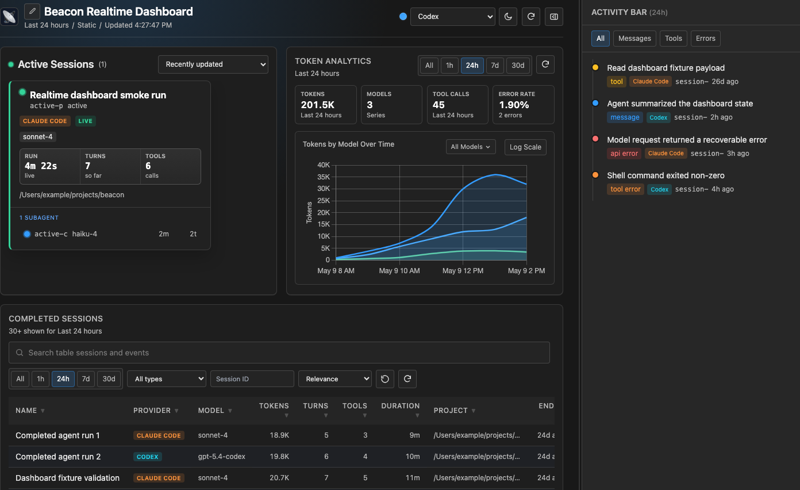
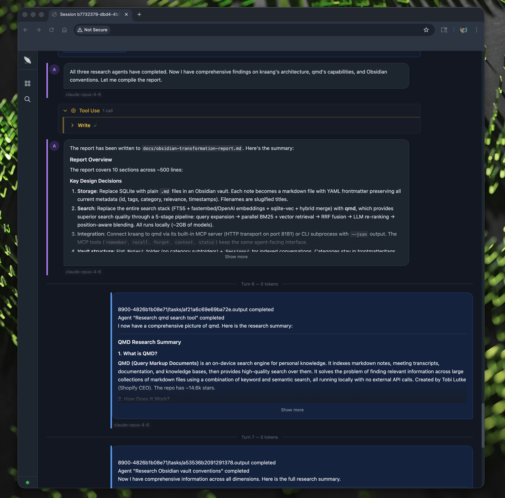

<p align="center">
  
</p>

Beacon is a local dashboard for long-running AI coding agents. It watches the session files already on your machine, writes normalized events to ClickHouse, and gives you a live view of what agents are doing, which tools they used, how much token volume they consumed, and what happened in past runs.

## What It Looks Like

**Dashboard overview.** Token volume, model health, active sessions, completed runs, integrated search, and a live activity timeline in one view.

<p>
  
</p>

**Session transcript.** A single run with session metrics, token charts, tool usage, and the replayable conversation below.

<p>
  
</p>

## Why Use Beacon

- See active and completed agent runs in one place, including project paths, models, duration, turns, tool calls, and subagents.
- Catch expensive or noisy work quickly with token charts, cache-token counts, model health, and error activity.
- Search prompts, responses, tool calls, paths, and errors across captured sessions without rebuilding an external search service.
- Replay a session as a readable transcript with expandable tool payloads and timeline context.
- Let agents query prior work through MCP tools instead of asking you to remember which session contained the answer.

Beacon currently understands session data from Claude Code, OpenAI Codex, Hermes Agent, OpenCode, and Pi coding-agent runs.

## Install

Beacon is distributed through GitHub Releases and the install script below. The installer supports macOS and Linux on `amd64` and `arm64` when the selected release includes the matching archive.

```bash
curl -sSfL https://johnnygreco.dev/beacon/install.sh | sh
```

It installs `beacon` to `~/.local/bin`. If ClickHouse is not already available on `PATH`, it also installs a managed ClickHouse binary to `~/.beacon/bin`.
Beacon release archives are verified against the release `checksums.txt` before
they are installed. Managed Linux ClickHouse downloads are verified with
ClickHouse's upstream `.sha512` sidecars; managed macOS ClickHouse downloads rely
on the pinned ClickHouse release URL and HTTPS because upstream does not publish
sidecar checksums for those macOS assets. The selected Beacon release must
include the current platform archive and `checksums.txt`; older partial releases
may only install on platforms they published.

If your shell cannot find `beacon`, add the install directory to `PATH`:

```bash
export PATH="$HOME/.local/bin:$PATH"
```

Common variants:

```bash
curl -sSfL https://johnnygreco.dev/beacon/install.sh | INSTALL_DIR=/usr/local/bin sh
curl -sSfL https://johnnygreco.dev/beacon/install.sh | VERSION=0.3.0 sh
curl -sSfL https://johnnygreco.dev/beacon/install.sh | INSTALL_CLICKHOUSE=0 sh
curl -sSfL https://johnnygreco.dev/beacon/install.sh | VERIFY_CHECKSUMS=0 sh
curl -sSfL https://johnnygreco.dev/beacon/install.sh | UNINSTALL=1 sh
```

Use `INSTALL_CLICKHOUSE=0` only when you already run ClickHouse yourself.
Use `VERIFY_CHECKSUMS=0` only for local installer debugging or emergency
workarounds. `UNINSTALL=1` removes the installed `beacon` binary and `~/.beacon`,
including Beacon-managed ClickHouse data.

Homebrew packaging is not currently a supported distribution channel.

## Start

```bash
beacon up
```

Open [http://localhost:4600](http://localhost:4600). On startup, Beacon loads `~/.beacon/beacon.toml` if it exists, starts local ClickHouse when the configured ClickHouse address is local, migrates the schema, backfills existing sessions, and then watches for new events.

Useful commands:

```bash
beacon status   # server, ClickHouse, session, and search-index health
beacon down     # stop the running Beacon web server
beacon db down  # stop Beacon-managed local ClickHouse
```

## Capture Sources

These sources are enabled by default:

| Source | Runtime | Default path |
|--------|---------|--------------|
| Claude Code | `claude-code` | `~/.claude/projects/**/*.jsonl` |
| OpenAI Codex | `codex` | `~/.codex/sessions/**/*.jsonl` |
| Hermes Agent | `hermes-agent` | `~/.hermes/state.db` |
| OpenCode | `opencode` | `~/.local/share/opencode/opencode*.db` |
| Pi coding agent | `pi-coding-agent` | `~/.pi/agent/sessions/**/*.jsonl` |

Backfill runs on startup by default, then the watcher keeps configured paths up to date.

## Configuration

Beacon reads `~/.beacon/beacon.toml` by default. Pass `--config <path>` to use another file:

```bash
beacon --config ./beacon.toml up
```

Start from the example in [beacon.toml](beacon.toml). The settings most people change are the web port, ClickHouse address, and capture sources:

```toml
[server]
host = "0.0.0.0"
port = 4600

[database]
addrs = ["127.0.0.1:9000"]
database = "beacon"
username = "default"
password = ""
secure = false

[[capture.sources]]
name = "codex"
runtime = "codex"
provider = "openai"
glob = "~/.codex/sessions/**/*.jsonl"
watch_root = "~/.codex/sessions"
format = "jsonl"
```

Ports must be in `1..65535`, ClickHouse addresses must include a host and port,
and each capture source must set `name`, `runtime`, `provider`, `format`,
`watch_root`, and either `glob` or `globs`. Supported runtime/format pairs are
`claude-code/jsonl`, `codex/jsonl`, `hermes-agent/sqlite`, `opencode/sqlite`,
and `pi-coding-agent/jsonl`.

If `[database].addrs` points to a remote ClickHouse host, Beacon will not start ClickHouse for you. Start the database yourself and run `beacon db migrate`.

## Documentation

- [Architecture and data flow](docs/architecture.md)
- [Privacy, retention, and local data boundaries](docs/privacy.md)
- [Pricing estimate data and fallback behavior](docs/pricing.md)
- [Performance baselines and query-plan review](docs/performance.md)
- [ClickHouse schema, migration, and reset policy](docs/clickhouse.md)
- [Errors and observability](docs/errors.md)
- [Toolchain and dependency updates](docs/toolchain.md)
- [Installer and release process](docs/release.md)

## ClickHouse

For local addresses such as `127.0.0.1:9000`, `localhost:9000`, or `0.0.0.0:9000`, `beacon up` and `beacon watch` try to start ClickHouse when it is not already reachable.

Auto-start prefers:

1. a `clickhouse` binary from `BEACON_CLICKHOUSE_BIN`, `PATH`, or `~/.beacon/bin/clickhouse`
2. an existing Docker container named `beacon-clickhouse`
3. a new Docker container using `clickhouse/clickhouse-server:24.12`

Manual database commands:

```bash
beacon db up            # start local ClickHouse and migrate tables
beacon db down          # stop Beacon-managed local ClickHouse
beacon db migrate       # migrate an already-running ClickHouse
beacon db refresh-projections # rebuild derived session and analytics projections
beacon db reset --force # destructive: drop and recreate Beacon tables
```

By default, `beacon db up` uses the managed ClickHouse binary when available and falls back to Docker.

Native ClickHouse data lives under `~/.beacon/clickhouse`. Docker mode uses the `beacon-clickhouse-data` volume.

For schema ownership, migration behavior, reset policy, and local data
locations, see [docs/clickhouse.md](docs/clickhouse.md).

## MCP Integration

Run `beacon db up` first so ClickHouse is available and migrated, then add Beacon to your MCP client:

```json
{
  "mcpServers": {
    "beacon": {
      "command": "beacon",
      "args": ["mcp"]
    }
  }
}
```

If your MCP client cannot use Beacon's config file, pass ClickHouse directly:

```json
{
  "mcpServers": {
    "beacon": {
      "command": "beacon",
      "args": ["mcp", "--clickhouse", "127.0.0.1:9000"]
    }
  }
}
```

Available tools:

- `search_sessions` searches the precomputed activity index and returns session/event IDs.
- `open` retrieves one event plus nearby context from the same session.
- `list_sessions` lists recent sessions with summary stats.

## Commands

| Command | Use it for |
|---------|------------|
| `beacon up` | Start the dashboard and capture service |
| `beacon down` | Stop the running Beacon web server |
| `beacon watch` | Capture sessions without the web dashboard |
| `beacon mcp` | Start the MCP server over stdin/stdout JSON-RPC |
| `beacon status` | Show server, database, session, and search-index status |
| `beacon db up` | Start local ClickHouse and migrate tables |
| `beacon db down` | Stop Beacon-managed local ClickHouse |
| `beacon db migrate` | Create or update ClickHouse tables |
| `beacon db refresh-projections` | Rebuild derived session and analytics projections |
| `beacon db reset --force` | Delete Beacon data and recreate tables |

## Build From Source

Source builds require Go 1.24.1 or newer. Node/npm are only needed for
Playwright tests and vendoring browser assets.

```bash
git clone https://github.com/johnnygreco/beacon.git
cd beacon
make build
./bin/beacon up
```

Development commands:

```bash
make generate       # regenerate templ output
make generate-check # verify generated templ output is current
make fmt            # gofmt tracked Go files
make fmt-check      # verify tracked Go files are gofmt formatted
make test           # generate templates and run Go tests
make test-race      # run Go tests with the race detector
make test-cover     # run Go tests with race, coverage, and coverage floors
make perf-bench     # run perf benchmarks; set PERF_SIZE=small|medium|large
make clean          # remove build/test outputs such as bin, dist, coverage, and reports
make clean-local    # also remove ignored repo-local scratch/agent dirs and local DB files
make clean-deps     # remove node_modules
npm install         # install Playwright and asset-vendoring dependencies
npm run vendor       # refresh vendored frontend assets
npm run vendor:check # verify vendored frontend assets and notices are current
npm run test:frontend # JS lint and unit tests
npm run test:e2e    # dashboard and integrated search Playwright tests
npm run test:a11y   # accessibility tests
npm run test:visual # visual regression tests
```

Cleanup targets only remove files inside the repository checkout. They do not
delete Beacon user data under `~/.beacon`; use `beacon db reset --force` or the
installer's `UNINSTALL=1` path when you intentionally want destructive Beacon
data cleanup.

### Generated Templates

Beacon tracks both `.templ` source files and generated `_templ.go` files. After
editing any template source under `internal/views`, run `make generate` and
commit the generated Go diff with the source change. `make test`, `make build`,
and related local targets run generation first, but they do not replace the
explicit generated-file review before a PR.

Run `make generate-check` when you want the same stale-generated-output gate CI
uses. It reruns templ generation and fails if generation changes the worktree.
Template tests should render public components, pages, and partials and assert
the resulting HTML behavior, escaping, and helper output instead of targeting
generated `_templ.go` implementation lines.

Release commands:

```bash
make publish VERSION=x.y.z
```

`make publish` expects a clean, up-to-date `main` branch, a working `gh` authentication or `GITHUB_TOKEN`, `zig` for Linux CGO cross-builds, and `goreleaser` on `PATH`. It creates tag `vx.y.z`, runs a local GoReleaser build before pushing the tag, uploads the release artifacts to GitHub Releases, and attempts to roll back the release/tag if publishing fails after the tag push. See [Installer and release process](docs/release.md) for artifact names, verification behavior, and rollback commands.

Most Go tests do not need a live ClickHouse server. Live ClickHouse integration and perf tests are opt-in and require a reachable ClickHouse TCP endpoint:

```bash
beacon db up
BEACON_TEST_CLICKHOUSE=127.0.0.1:9000 go test ./internal/store ./internal/search ./internal/web
BEACON_TEST_CLICKHOUSE=127.0.0.1:9000 go test ./internal/perf -bench . -run '^$'
```

Playwright tests require Node dependencies from `npm install` and a Chromium
browser installed by Playwright. They start their own e2e server by default. To
test against an already running Beacon-compatible server, set
`BEACON_E2E_BASE_URL`.

Visual regression tests are intentionally local-only for now. The checked-in
snapshots are Chromium baselines captured on Darwin, and
`tests/e2e/visual.spec.ts` skips on other platforms so Linux CI does not compare
against incompatible raster output. Run them from macOS with:

```bash
npm run test:visual
npm run test:visual -- --update-snapshots
```

Only update visual snapshots after reviewing the rendered dashboard and
transcript states represented by the changed PNG files. Moving this suite into
CI should include a stable Linux baseline set or a hosted macOS runner, plus the
corresponding removal of the platform skip.

### Coverage Gates

CI enforces conservative Go coverage regression floors from `coverage.thresholds`.
The current gates are a total statement floor plus selected runtime packages
that should not regress without an intentional threshold update. Generated templ
packages, benchmark/perf helpers, simulator/perfseed binaries, and browser test
coverage are intentionally excluded from package floors.

Update `coverage.thresholds` in the same PR as any deliberate coverage target
change. `make test-cover` and CI both run `scripts/check-coverage.sh` against
the generated coverage profile.

## Troubleshooting

**`beacon` is not found after install.** Add the install directory to `PATH`, usually `export PATH="$HOME/.local/bin:$PATH"`.

**ClickHouse does not start.** Run `beacon db up`. Set `BEACON_CLICKHOUSE_BIN=/path/to/clickhouse` when Beacon should use a specific local binary.

**Beacon connects to the wrong database.** Check `[database].addrs` in `~/.beacon/beacon.toml` or pass `--config <path>`.

**No sessions appear.** Confirm the agent has written session files in one of the configured source paths, then run `beacon status` and restart with `backfill_on_start = true`.

**Port 4600 is already in use.** Change `[server].port` in the config file or stop the existing process with `beacon down`.

## Acknowledgements

This project was inspired by Wes McKinney's [agentsview](https://github.com/wesm/agentsview), Eric Tramel's [moraine](https://github.com/eric-tramel/moraine), and Simon Willison's [claude-code-transcripts](https://github.com/simonw/claude-code-transcripts).

Third-party browser asset notices are tracked in [THIRD_PARTY_NOTICES.md](THIRD_PARTY_NOTICES.md).

## License

[Apache License 2.0](LICENSE)
